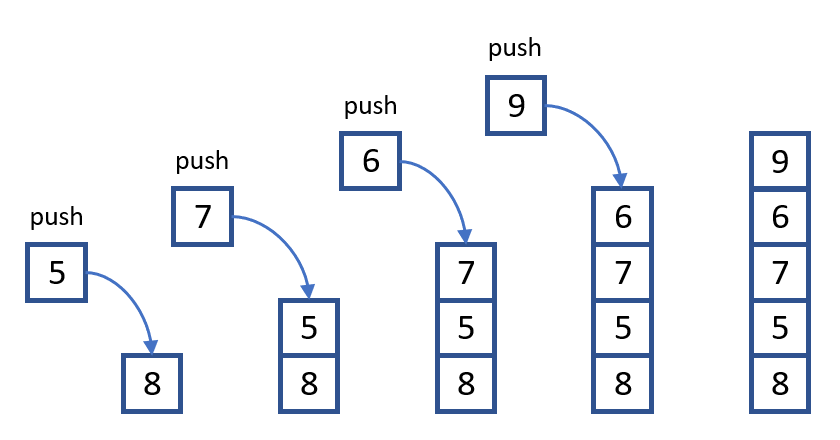
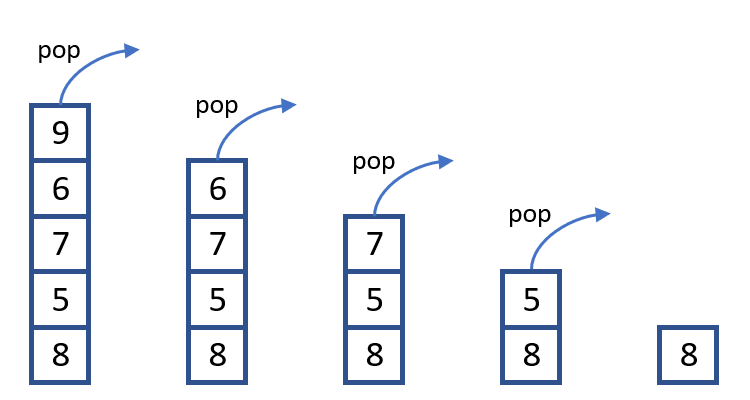

# Stack and Queue

## Stack
### Introduction
A [stack](https://en.wikipedia.org/wiki/Stack_\(abstract_data_type\)) is an abstract data type that serves as a collection of elements, with two principal operations:

- push, which adds an element to the collection, and
- pop, which removes the most recently added element that was not yet removed.

|   |   |
| :---: | :---: |
| Pushing | Poping |

The order in which elements come off a stack gives rise to its alternative name, **LIFO** _\(last in, first out\)_. The push and pop operations occur only at one end of the structure, referred to as the top of the stack. This makes it possible to implement a stack as a **singly linked list** and a pointer to the top element. A stack may be implemented to have a bounded capacity. If the stack is full and does not contain enough space to accept an entity to be pushed, the stack is then considered to be in an overflow state. The pop operation removes an item from the top of the stack.

Several main applications of the stack can be named as follows:

- Back-tracking algorithm, i.e. to implement the **depth-first search** algorithm, sudoku solver or the Knight’s tour problem;
- Expression evaluation and syntax parsing;
- Topological sorting and Strongly connected components searching.


### Implementation
In Python, a stack can be conveniently implemented by **List**.
```python
from random import randint

# Initialisation
stack = []

# Push values into a stack
size  = 10
for x in range(size):
    stack.append(randint(1,size))
print(*stack)
    
# Pop the last value and print it out
while (len(stack) > 0):
    print(stack.pop(), end = ' ')
```

To illustrate the usage of stack, let solve the [Reverse Polish Notation](https://www.spoj.com/problems/ONP/) problem together. This is a typical problem of _Expression evaluation and syntax parsing_.

| Input | Output |
| ---   | ---    |
| $$(a+(b*c))$$ | $$abc*+$$ |
| $$((a+b)*(z+x))$$ | $$ab+zx+*$$ |
| $$((a+t)*((b+(a+c))^(c+d)))$$ | $$at+bac++cd+^*$$ |

The solution of this problem can be summarized as follows:

- the symbol \( and \) are not printed out but to track the priority of which expression;
- the variables are printed out first, then the operators are printed out later when the symbol \) is encounter.

Python code for this problem is:

  ```python
  def transform(str):
      alphas = [chr(i) for i in range(ord('a'), ord('z')+1)]
      stack  = []
  	
      for ch in str:
          if (ch in alphas):
  			      print(ch, end = '')
  		    elif (ch == ')'):
  			      print(stack.pop(), end = '')
  		    elif (ch != '('):
  			      stack.append(ch)
  str = '((a+t)*((b+(a+c))^(c+d)))'
  transform(str)   # Output: at+bac++cd+^*
  ```

### Problem for practice
Please practice with the following problems:

* [g4g Stockspan](https://www.geeksforgeeks.org/the-stock-span-problem/)
* [hr Balanced brackets](https://www.hackerrank.com/challenges/ctci-balanced-brackets/problem)
* [spoj Mass of molecule](https://www.spoj.com/problems/MMASS)
* [spoj Street parade](https://www.spoj.com/problems/STPAR)


## Queue
### Introduction

### Implementation


### Problem for practice
Please practice with the following problems:

* [Uva Throwing cards away I](https://uva.onlinejudge.org/index.php?option=onlinejudge&page=show_problem&problem=1876)
* [Uva That is your queue](https://uva.onlinejudge.org/index.php?option=onlinejudge&page=show_problem&problem=3359)
* [Uva Ferry loading III](https://uva.onlinejudge.org/index.php?option=onlinejudge&page=show_problem&problem=1842)

