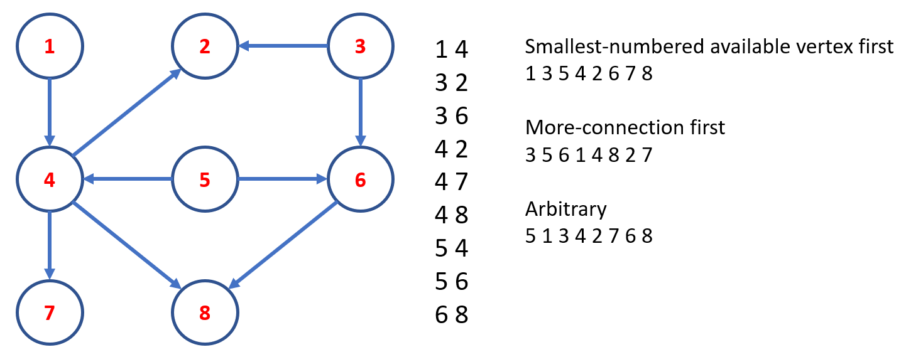

# Topological sort

## Introduction
A [topological sorting](https://en.wikipedia.org/wiki/Topological_sorting) or topological ordering of a directed graph is a linear ordering of its vertices such that for every directed edge $$u-v$$ from vertex $$u$$ to vertex $$v$$, $$u$$ comes before $$v$$ in the ordering. The following figure illustrates a graph and several possible topological sort-configurations of that graph. 

A topological sorting is possible if and only if the graph has no directed cycles, a directed acyclic graph (DAG). Any DAG has at least one topological order, and algorithms are known for constructing a topological order of any DAG in linear time.

