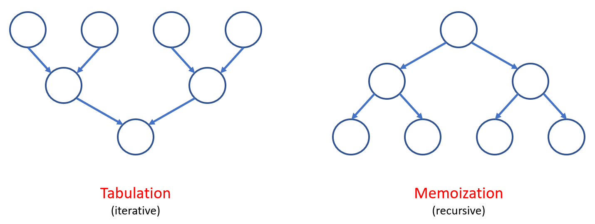
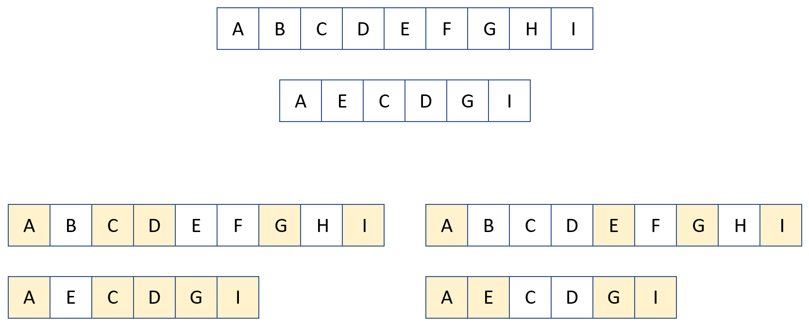
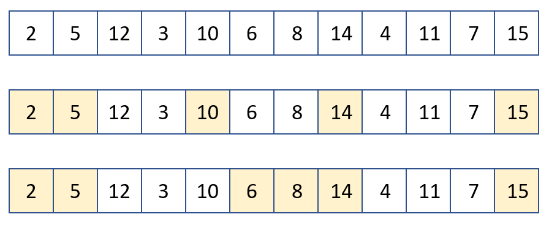
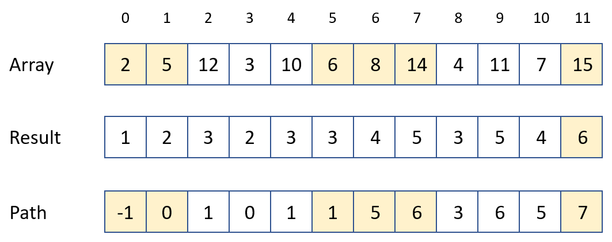
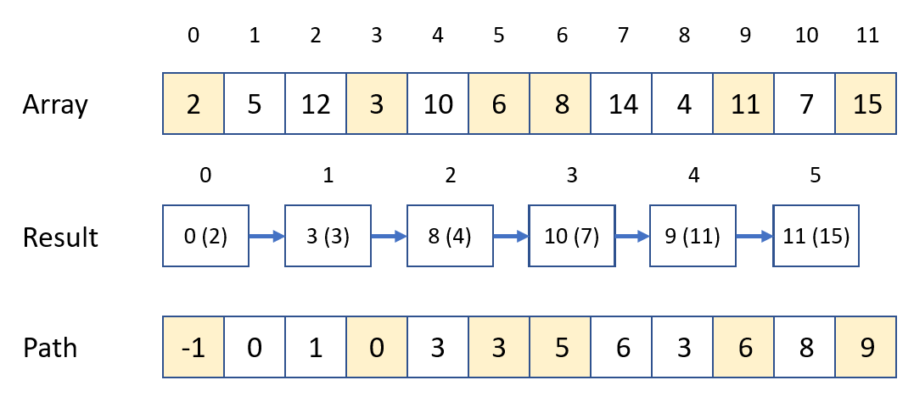

# Dynamic programming

## Briefing
Dynamic programming is a technique of algorithmic design in which a problem is divided into sub-problems and results of sub-problems are combined into the result of the original problem. Results of a dynamic programming solution are often stored in a table, 1- or 2-dimensional array to avoid recalculation. There are two main approaches followning the dynamic programming technique, the top-down approach and the bottom-up one. 

- the top-down approach (memoization): using recursive technique to find solutions of sub-problems and store them into a table, when the sub-problem is encountered, its solution is taken out without recalculation.
- the bottom-up approach (tabulation): using the loop-statement to solve first sub-problems then the main problem.

Nevertheless, the core of the dynamic programming technique is, first, finding the induction formulae of the problem.



The bottom-up and top-down approaches can be illustrated through the Fibonacci problems as follows:




The $$n$$-th Fibonacci number is defined as: 

  $$ f[0] = 0; \quad f[1] = 1; \quad f[n] = f[n-1] + f[n-2]$$




```python
n = 100
result = [0] * (n+1)

result[0] = 0
result[1] = 1

def fibonacci_rec(n):
    if n <= 1: return n
    if result[n] != 0: return result[n]
    else:
        result[n] = fibonacci_rec(n-1) + fibonacci_rec(n-2)
        return result[n]
        
print(fibonacci_rec(n))        
```



```python
n = 100
result = [0] * (n+1) 

def fibonacci_ite1(n):
    result[0] = 0
    result[1] = 1
    for i in range(2, n + 1):
        result[i] = result[i - 1] + result[i - 2]
    return result[n]
    
def fibonacci_ite2(n):
    a0, a1 = 0, 1
    for i in range(2, n + 1):
        a0, a1 = a1, a0 + a1
    return a1
    
print(fibonacci_ite1(n))
print(fibonacci_ite2(n))
```

  
It will take time to have a good feeling about DP. The next sections will provide illustrations for several DP problems to help the reader be familiar with the technique. A simple trick is using paper-and-pen to solve a sub-problem with a gradually-increasing size to come up with the inductive formulae. Once you have the formulae, coding is not that difficult anymore. 

There are several very good references for Dynamic Programming (DP) as follows:

* [interviewbit](https://www.interviewbit.com/courses/programming/topics/dynamic-programming/)
* [topcoder](https://www.topcoder.com/community/competitive-programming/tutorials/dynamic-programming-from-novice-to-advanced/)
* [skerritt](https://skerritt.blog/dynamic-programming/)
* [itnext](https://itnext.io/introduction-to-multi-dimensional-dynamic-programming-666b095b2e7b)
* [blogarithms](https://blogarithms.github.io/articles/2019-03/cracking-dp-part-one)
* [brilliant](https://brilliant.org/wiki/problem-solving-dynamic-programming/)
* [hackerearth](https://www.hackerearth.com/practice/algorithms/dynamic-programming/introduction-to-dynamic-programming-1/tutorial/)
* [geeksforgeeks](https://www.geeksforgeeks.org/dynamic-programming/)


## Illustration 01: Staircase and Coin-change
In this type of problems, the DP solution can be stored in a 1-dimensional array.

### Staircase problem
Problem statement: there is a staircase with $$N$$ steps ($$N$$ is a positive integer). You can jump over 1 or 2 steps at once. How many paths to go over the staircase if you start from the ground ?

Induction formulae: $$ path[0] = 1; \quad path[1] = 1; \quad path[n] = path[n-1] + path[n-2]$$ with $$n$$ is the number of steps of the staircase at the time of consideration and $$path$$ is the number of paths to go from the ground to the $$n$$-th step. This inductive formulae is similar to that of the Fibonacci problem.


### Coin-change problem
A rather similar problem to the staircase problem is the coin-change problem. Problem statement: given an amount of money $$total$$ and $$n$$ type of coins (with the unlimited amount of each coins). Count and print out the number of coin changes.




Let's do it by hand the following steps:

- arrange the coins from the smallest to the largest value
- at the first step, assume that you can use only the smallest coin to build up the amount $$total$$
- at each next steps, gradually add one more type of coin and recalculate the number of way to build up the amount $$total$$
- then you can find the induction formulae.

```python
total = 29
n = 4
coins = [2, 3, 5, 7, 11]
numbs = coinchange(total, n, coins)
print("Number of solution : ", numbs)
result = []
if numbs > 0: solprint(result, total, n, coins, 0)
```



```python
def coinchange(total, n, coins):
    result = [0] * (total + 1)
    result[0] = 1

    for i in range(n):
        for j in range(coins[i], total + 1):
            result[j] += result[j - coins[i]]
    return result[total]
```



To list all possible solutions of this problem, one may use the backtracking technique. Assume that you have to use the smallest coins to build up the $$total$$ amount (in fact, it may be possible that you can not build up $$total$$ by only using the smallest coin; but this does not matter at all). Then gradually take out coin by coin and check if any coin of large values can be put in.

```python
def solprint(result, total, n, coins, pos):
    if total == 0: print(*result)

    for i in range(pos, n):
        if total >= coins[i]:
            result.append(coins[i])
            solprint(result, total - coins[i], n, coins, i)
            result.pop()
```



### Problems for practice
The following problems from different sources can be used to practice:

- [spoj_Alphacode](https://www.spoj.com/problems/ACODE/)
- [spoj_Bytelandian gold coins](https://www.spoj.com/problems/COINS/)
- [spoj_Philosophers stone](https://www.spoj.com/problems/BYTESM2/)
- [timus_K-based numbers](https://acm.timus.ru/problem.aspx?space=1&num=1009)
- [uva_Ingenuous cubrency](https://onlinejudge.org/index.php?option=com_onlinejudge&Itemid=8&page=show_problem&problem=2078)


## Ilustration 02: Longest common subsequence and Longest increasing subsequence
### Longest common subsequence
Problem statement: given two strings with the length of $$(m, n)$$, find their longest common subsequence (the characters are not required to be adjacent).






Solution: compare character-by-character from two strings, then we have two possibilities:

- if the two characters are identical, the result will increase and this character is chosen;
- if the two characters are different, we need to consider two cases: (1) each character of the first string to compare with characters from the second string, and (2) vice versa. The maximum of these two cases will be used.

This solution is illustrated through the naive recursive function as follows:

```python
def lcs_recursive(s1,s2,i1,i2):
    if (i1 == 0) or (i2 == 0):
        return 0
    elif s1[i1-1] == s2[i2-1]:
        return 1 + lcs_recursive(s1,s2,i1-1,i2-1)
    else:
        return max(lcs_recursive(s1,s2,i1-1,i2), lcs_recursive(s1,s2,i1,i2-1))
```

Time complexity of this implementation is $$O(2^{m+n})$$. To reduce the time complexity of the solution to $$O(m \times n)$$, the dynamic programming is used with exactly the same methodology. Additionally, the intermedia results are stored for reuse. 

```python
s1 = 'ABCDEFGHI'
s2 = 'AECDGI'

print(lcs_recursive(s1,s2,len(s1),len(s2)), end = ' vs ')

lcs = [[-1 for i in range(len(s2) + 1)] for i in range(len(s1) + 1)]
print(dp_down(s1,s2,len(s1),len(s2)), end = ' vs ')

lcs = [[0 for i in range(len(s2) + 1)] for i in range(len(s1) + 1)]
print(dp_up(s1,s2))

print_lcs(s1, s2, lcs)
```



```python
def dp_down(s1,s2,i1,i2):
    if (i1 == 0) or (i2 == 0):
        return 0
    if lcs[i1-1][i2-1] != -1:
        return lcs[i1-1][i2-1]
    if s1[i1-1] == s2[i2-1]:
        lcs[i1-1][i2-1] = 1 + dp_down(s1,s2,i1-1,i2-1)
        return lcs[i1-1][i2-1]
    else:
        lcs[i1-1][i2-1] =  max(dp_down(s1,s2,i1-1,i2), dp_down(s1,s2,i1,i2-1))
        return lcs[i1-1][i2-1]
```       



```python
def dp_up(s1,s2):
    ls1 = len(s1)
    ls2 = len(s2)
    for i in range(1,ls1+1):
        for j in range(1,ls2+1):
            if s1[i-1] == s2[j-1]:
                lcs[i][j] = lcs[i-1][j-1] + 1
            else:
                lcs[i][j] = max(lcs[i-1][j],lcs[i][j-1])

    return lcs[ls1][ls2]
```



The subsequence can be found based on the result table from the dynamic programing calculation. We start from the index $$(m,n)$$ and compare charaters from the two strings. 

- if the characters are not identical, follow the direction with the higher value between `lcs[i-1][j]` and `lcs[i][j-1]`
- if the characters are identical, take that character and proceeds to `[i-1][j-1]`.

```python
def print_lcs(s1,s2,lcs):
    result = []
    i, j = len(s1), len(s2)
    while i > 0 and j > 0:
        if s1[i-1] == s2[j-1]:
            result.append( s1[i-1])
            i -= 1
            j -= 1
        elif lcs[i-1][j] > lcs[i][j-1]:
            i -= 1
        else:
            j -= 1
    result.reverse()

    print(*result, end = '')
```   


### Longest increasing subsequence
Problem statement: given an array of $$n$$ random integers, find the longest subsequence of increasing number. 






The main idea to solve this problem can be summarised as follows:

- Suppose that we have the longest increasing subsequence with the last item `a[i]`, if we find another item `a[j]` in which `j > i` and `a[j] > a[i]` then we can add `a[j]` into the current-longest subsequence to form a longer subsequence. By doing this procedure repeatedly, the longest increasing subsequence can be found.
- More detail: at each location of the array, find the last location at which the item is smaller than the item at the current location to increase the length of the subsequence. One configuration of item of the longest increasing subsequence can be traced back through an extra array. In this step, there are actually two implementation types, naive DP and DP in combination with binary-search to reduce the time complexity.

```python
a = [2,5,12,3,10,6,8,14,4,11,7,15]

length, result, path = lis_bs(a)
print_lis_bs(a, length, result, path)

length, last, path = lis_dp(a)
print_lis_dp(a, length, last, path)
```



Naive DP solution has the time complexity of $$O(n^2)$$.



```python
def lis_dp(a):
    path = [-1] * len(a)
    result = [1] * len(a)

    for i in range(1, len(a)):
        for j in range(i):
            # attention here: i>=j for non-decreasing
            if (a[i] > a[j]) and (result[i] < result[j] + 1):
                result[i] = result[j] + 1
                path[i] = j

    length = 0
    for i in range(len(a)):
        if length < result[i]:
            last = i
            length = result[i]

    return length, last, path


def print_lis_dp(a, length, last, path):
    print(length)
    b = []
    i = last
    while i != -1:
        b.append(a[i])
        i = path[i]
    for i in range(len(b)-1,-1,-1):
        print(b[i], end = ' ')
```



This algorithm bases on the idea of Solitaire game in which all of the elements of the array is considered, suitable items are added into the solution list whereas currently unsuitable items are stored in the waiting list. Following this idea, of all subsequences with the same length, only the smallest item is stored becasue it has a bigger chance to be extended $$result$$. The binary search algorithm can be combined to reduce the time complexity to $$O(n \log{n})$$.



The implementation of this algorithm is given below. Please noted that the $$result$$ array stores the location of the item. The $$path$$ array is used to trace back the final result. Please take a look at the results obtained by the naive DP algorithm and the DP + binary-search algorithm to see the difference of the chosen item in the final result.

```python
def find_last(a, sub, n, x):
    left = 0
    right = n
    pos = right

    while left < right:
        mid = left + (right-left) // 2
        ind = sub[mid]
        # attention here: > for non-decreasing
        if a[ind] >= x:
            pos = mid
            right = mid
        else:
            left = mid + 1

    return pos


def lis_bs(a):
    length = 1
    path = [-1] * len(a)
    result = [0]

    for i in range(1, len(a)):
        if a[i] < a[result[0]]:
            result[0] = i
        # attention here: >= for non-decreasing
        elif a[i] > a[result[length-1]]:
            path[i] = result[length-1]
            result.append(i)
            length += 1
        else:
            pos = find_last(a, result, length, a[i])
            path[i] = result[pos-1]
            result[pos] = i

    return length, result, path


def print_lis_bs(a, length, result, path):
    print(length)
    b = []
    i = result[length-1]
    while i != -1:
        b.append(a[i])
        i = path[i]
    for i in range(len(b)-1,-1,-1):
        print(b[i], end = ' ')
    print()
```


### Problems for practice
The following problems from different sources can be used to practice:

- [cf_Beautiful people](https://codeforces.com/problemsets/acmsguru/problem/99999/199)
- [cf_Palindromic characteristics](https://codeforces.com/contest/835/problem/D)
- [g4g_LCS 3-string](https://www.geeksforgeeks.org/lcs-longest-common-subsequence-three-strings/)
- [lightoj_Love calculator](https://vjudge.net/problem/LightOJ-1013)
- [spoj_Advanced fruits](https://www.spoj.com/problems/ADFRUITS/)
- [spoj_Aibohphobia](https://www.spoj.com/problems/AIBOHP/)
- [spoj_Cross country](https://vn.spoj.com/problems/CRSCNTRY/)
- [uva_Compromise](https://onlinejudge.org/index.php?option=onlinejudge&page=show_problem&problem=472)
- [uva_Prince And Princess](https://onlinejudge.org/index.php?option=com_onlinejudge&Itemid=8&page=show_problem&problem=1576)
- [uva_Testing the CATCHER](https://onlinejudge.org/index.php?option=com_onlinejudge&Itemid=8&page=show_problem&problem=167)
- [uva_Tower of Babylon](https://onlinejudge.org/index.php?option=onlinejudge&page=show_problem&problem=378)
- [uva_Wavio sequence](https://onlinejudge.org/index.php?option=onlinejudge&page=show_problem&problem=1475)


## Evan further problems for practice

* [leetcode](https://leetcode.com/tag/dynamic-programming/)
* [hackerrank](https://www.hackerrank.com/domains/algorithms?filters%5Bsubdomains%5D%5B%5D=dynamic-programming)
* [spoj](https://apps.topcoder.com/forums/?module=Thread&start=0&threadID=674592)
* [codeforces](https://codeforces.com/blog/entry/325)
* [geeksforgeeks](https://practice.geeksforgeeks.org/explore/?category%5B%5D=Dynamic%20Programming&page=1&sortBy=accuracy)
* [spoj](https://www.spoj.com/problems/tag/dynamic-programming)
* [usejournal](https://blog.usejournal.com/top-50-dynamic-programming-practice-problems-4208fed71aa3)
