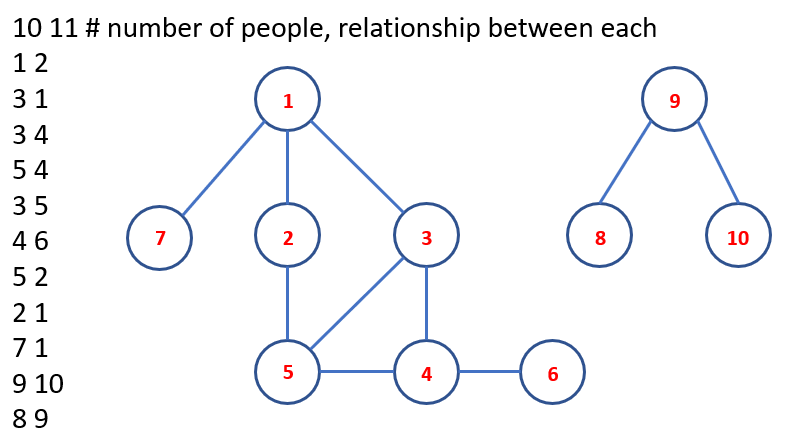

# Disjoint Set Union

## Briefing

A [disjoint-set](https://en.wikipedia.org/wiki/Disjoint-set_data_structure) data structure \(also called a union–find data structure or merge–find set because of its two main operation\) is a data structure that tracks a set of elements partitioned into a number of disjoint \(non-overlapping\) subsets. It provides near-constant-time operations to add new sets, to merge existing sets, and to determine whether elements are in the same set.

Applications:

* has a key role in Kruskal's algorithm for finding the minimum spanning tree of a graph;
* keeps track of the connected components of an undirected graph;

An example of classifying loops of friends \(middle and right\) connected to each others based on pairs of relationship \(left\) can be illustrated on the following image.



## Operations and implementations

A disjoint-set forest consists of a number of elements each of which stores an _identification number_, a _parent pointer_, and, in efficient algorithms, either a _size_ or a _rank_ value. Forests can be represented compactly in memory as arrays in which parents are indicated by their array index. A root of a disjoint-set forest is a vertex having the parent as itself.

There are two, actually three including the initialisation, [operations](https://cp-algorithms.com/data_structures/disjoint_set_union.html) of a disjoin-set: makeSet, findSet and unionSet.

### makeSet

 **makeSet** makes a new set by creating a new element with a unique _id_, a _rank_ of 0, a _size_ of 1 and a parent pointer to itself.

The following code initialises a disjoint-set:

```python
def makeSet(size):
    global parent, ranks, sizes
    parent = [i for i in range(size + 1)]
    ranks  = [0 for i in range(size + 1)]
    sizes  = [1 for i in range(size + 1)]
```

### findSet

**findSet**$$(u)$$ returns the representative \(also called leader\) of the set that contains the element $$u$$. This representative is an element of its corresponding set which is selected in each set by the data structure itself \(and can change over time, namely after **unionSet** calls\).

A naive implementation of **findSet**$$(u)$$ simply climb the parent of the vertex $$u$$ until reaching the root, the implementation can be in recursive version as follows:

```python
def findSet(u):
    if (u != parent[u]):
        u = findSet(parent[u])       
    return u
```

or iterative-version:

```python
def findSet(u):
    while (u != parent[u]):
        u = parent[u]       
    return u
```

However this implementation is inefficient, i.e. with trees degenerate into long chains, **findSet**$$(u)$$ can take $$O(n)$$ time.

The **findSet** operation can be optimised in the way that the path from $$u$$ to _root_ is not incrementally shortened as in the naive implementation. There are three types of optimisation, namely:

* **path compression**: every node points to the root whenever **findSet** is used on it.

  ```python
  def findSet(u):
      if (u != parent[u]):
          parent[u] = findSet(parent[u])       
      return parent[u]
  ```

* **path halving**: every other node on the path points to its grandparent.

  ```python
  def findSet(u):
      while (u != parent[u]):
          parent[u] = parent[parent[u]]
          u = parent[u]      
      return u
  ```

* **path splitting**: every node on the path points to its grandparent.

  ```python
  def findSet(u):
      while (u != parent[u]):
          u, parent[u] = parent[u], parent[parent[u]]   
      return u
  ```

### unionSet

**unionSet**$$(u,v)$$ merges the two specified sets, the set in which the element $$u$$ is located, and the set in which the element $$v$$is located. **unionSet** uses **findSet** to determine the roots of the trees $$u$$ and $$v$$ belong to. If the roots are distinct, the trees are combined by attaching the root of one to the root of the other.

The naive implementation simply always makes $$v$$ a child of $$u$$ \(the second tree is attached to the first one\) but then the height of the trees can grow as $$O(n)$$ as happening with **findSet**.

```python
def unionSet(u, v):
    up = findSet(u)
    vp = findSet(v)   

    if (up != vp):
        parent[v] = u
```

To optimise the **unionSet** operation, we will change which tree gets attached to the other one. The most two popular approaches are: \(1\) based on the depth of the tree _rank_ or, more precisely, the upper bound on the tree depth, because the depth will get smaller when applying path compression; and \(2\) based on the size of the tree _size_. The essence of optimization in both approaches is actually similar the tree with the lower rank is attached to the one with the bigger rank.

* based on the depth of the tree _rank_

  ```python
  def unionSet(u, v):
      up = findSet(u)
      vp = findSet(v)   

      # u, v are already in the same set
      if (up == vp):
          return

      # u, v are not in the same set -> merging
      if (ranks[up] < ranks[vp]):
          up, vp = vp, up

      parent[vp] = up
      if (ranks[up] == ranks[vp]):
          ranks[up] += 1
  ```

* based on the size of the tree _size_

  ```python
  def unionSet(u, v):
    up = findSet(u)
    vp = findSet(v)   

    # u, v are already in the same set
    if (up == vp):
        return

    # u, v are not in the same set -> merging
    if (sizes[up] < sizes[vp]):
        up, vp = vp, up

    parent[vp] = up
    sizes[up] += sizes[vp]
  ```

The convenience of following the union by size is that, at the end, we can know how large each independent set is in $$sizes[root]$$, i.e. the following code for the example in the figure above shows:

```python
n, m = map(int, input().split())
makeSet(n)
for i in range(m):
    u, v = map(int, input().split())
    unionSet_size(u,v)

# OUTPUT: sizes = [1, 7, 1, 1, 1, 1, 1, 1, 1, 3, 1]
```

## Problems for practice

The following problems from different sources can be used to practice the disjoint-set data structure:

* [cf Cthulhu](https://codeforces.com/problemset/problem/103/B)
* [cf Ice skating](https://codeforces.com/problemset/problem/217/A)
* [uva Forests](https://uva.onlinejudge.org/index.php?option=onlinejudge&page=show_problem&problem=1168)
* [uva Friends](https://onlinejudge.org/index.php?option=com_onlinejudge&Itemid=8&page=show_problem&problem=1549)
* [uva Graph connectivity](https://onlinejudge.org/index.php?option=com_onlinejudge&Itemid=8&page=show_problem&problem=400)
* [uva War](https://uva.onlinejudge.org/index.php?option=com_onlinejudge&Itemid=8&page=show_problem&problem=1099)
* [timus Anansi's cobweb](http://acm.timus.ru/problem.aspx?space=1&num=1671)
* [cf Roads not only in Berland](https://codeforces.com/contest/25/problem/D)
* [spoj Strange food chain](https://www.spoj.com/problems/CHAIN/)
* [spoj Colorful array](https://www.spoj.com/problems/CLFLARR/)

