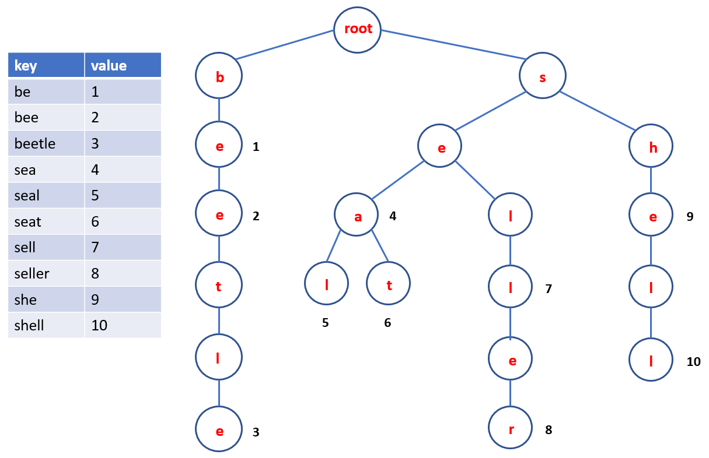

# Trie

## Briefing

A [trie](https://en.wikipedia.org/wiki/Trie), also called digital tree or prefix tree, is a kind of search tree—an ordered tree data structure used to store a dynamic set or associative array. Another good explanation of trie can be found [here](https://algs4.cs.princeton.edu/lectures/52Tries.pdf). In the example shown below, a dictionary is stored in a trie with characters are stored in nodes; at some specific nodes storing the last character of a word there is an arbitrary integer value associated with that word. In practice, a node can store more information depending on a problem to solve.



Applications:

* a typical application of a trie is storing predictive text or autocomplete dictionary;
* to implement approximate matching algorithms used in spell checking;
* to replace a hash table.

## Operations and implementations

Following the example shown above, a trie has many nodes, each nodes has two components: \(1\) a node of data, a node can connect to other nodes; \(2\) an integer variable which is different from 0 if its corresponding node contains the last character of a word \(a key\). A naive implementation of a trie in Python can be as follows:

```python
class Node:
    def __init__(self):
        self.value = 0
        self.child = dict()
```

There are four operations related to a trie: _insertion_, _search_, _deletion_ and _printing_ in a trie.

### Insertion

The main ideas are: \(1\) follow links corresponding to each character in the key \(word\), \(2\) encounter a null link \(last node\) then create a new node, \(3\) encounter the last character of the key then set value in that node.

```python
def trie_insert(root, st):
    tmp = root
    for ch in st:
        if not (ch in tmp.child):
            tmp.child[ch] = Node()
        tmp = tmp.child[ch]
    tmp.value += 1
```

### Search

Similar to _insertion_, the main ideas are: \(1\) follow links corresponding to each character in the key, \(2\) search found if the node where search ends has a non-null value, \(3\) search missed if a null link is reached or the node where search ends has a null value.

```python
def trie_search(root, st):
    tmp = root
    for ch in st:
        if not (ch in tmp.child):
            return False
        tmp = tmp.child[ch]
    return tmp.value > 0
```

### Deletion

To delete a key-value pair: \(1\) find the node corresponding to the last character of the key and set value to null, \(2\) if node has null value and null links, remove that node and recur. First of all, we need two functions to check if a node is a final character of a key \(has a null value\) and to check if a node has null links. These two functions can be implemented inline but they are presented here for clarification:

```python
def is_word(node):
   return node.value != 0

def is_empty(node):
   return (len(node.child) == 0)
```

```python
def trie_delete(root, st, level, length):
    if (root == None):
        return False

    if (level == length):
        if (root.value > 0):
            root.value -= 1
            return True
        return False

    ch   = st[level]
    flag = trie_delete(root.child[ch], st, level+1, length)

    if (flag) and (not is_word(root.child[ch])) and (is_empty(root.child[ch])):
        del root.child[ch]
        root.child[ch] = None

    return flag
```

### Printing

A simple recursive function can be written to print out the whole trie as follows:

```python
def trie_print(root, st):
    if is_word(root):
        print(st)

    for ch in root.child:
        trie_print(root.child[ch], st + ch)
```

## Problem for practice

The following problems are helful to let yourself be familiar with the trie data structures:

* [he Search engine](https://www.hackerearth.com/practice/data-structures/advanced-data-structures/trie-keyword-tree/practice-problems/algorithm/search-engine/description/)
* [lightoj DNA prefix](https://vjudge.net/problem/LightOJ-1224)
* [lightoj Consistency checker](https://vjudge.net/problem/LightOJ-1129)
* [hr Contacts](https://www.hackerrank.com/challenges/contacts/problem)
* [hr No Prefix Set](https://www.hackerrank.com/challenges/no-prefix-set/problem)
* [icp Diccionario Portunol](https://icpcarchive.ecs.baylor.edu/index.php?option=onlinejudge&page=show_problem&problem=3803)

