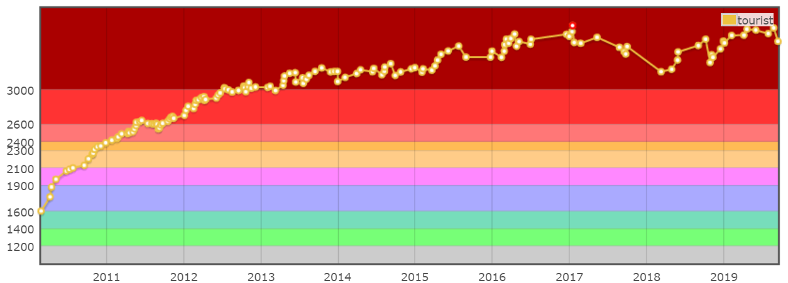

# Coding interview

This section will give a brief introduction of steps to get hired in a it-technology company:

1. Resume 
2. Data structure & Algorithm preparation
3. Submit an application
4. Mock interview
5. VISA application
6. Procedure of interview

The content of this section is summarised from a class in [BigO-coding](http://bigocoding.com/). You can have more insights on this topic and also valuable advises there. 

## Resume

A perfect guideline for an attractive RESUME can be found [here.](https://www.careercup.com/resume/)

## Data structure & Algorithm preparation

There are several good recommendations to tackle this task:

* [interviewbit](https://www.interviewbit.com/practice/) -&gt; practice atleast 200 problems here
* [leetcode](https://leetcode.com/problemset) -&gt; practice atleast 300 problems here

Remember to count the time elapsed until you finish the problem. During a real interview, you should finish a task within a limited time.

## Submit an application

There are several ways to do this:

* directly apply in the website of a company interested -&gt; successful rate of 0.01% due to so many perfect-CV from India or China, they have a team to buildup that kind of CV.
* join competitive programming contests of such company, this method is quite good because the top-100 is actually soldier of fortune so the company normally will perform an interview for top-1000 or top-10000 -&gt; successful rate of 50%.
  * [google](https://codingcompetitions.withgoogle.com/codejam);
  * [facebook](https://www.facebook.com/hackercup/contest);
  * [codechef](https://www.codechef.com/) summarises all kinds of contests.
* referral from someone \([Big-O center](http://bigocoding.com/) reserves 10 slots for its member every year from September to November\).
  * English: TOEFL 100 iBT, IELTS 7.5.
  * Online survey & test: one-tme submission only. 

## Mock interview

Several of the best site to practice a mock interview.

* [pramp](https://www.pramp.com/)
* [interviewing](https://interviewing.io/) 

Tips:

* choose a good time slot to have an interview with Americans.
* do about 20 interviews 
* provide feedbacks as details as possible.

## VISA application

A good webiste with good details and tips for working visa application can be found [here.](https://www.myvisajobs.com/)

## Procedure of interview

There are many round of interview:

* Round 1: for both Internship and Full-time, phone interview about 45', 1 to 2 questions with a difficulty equals to A and B of Div. 2 contest \(cf\) -&gt; data structures and algorithms.
* Round 2: for both Internship and Full-time, phone interview about 45', 1 to 2 questions with a difficulty equals to B and C or B+ \(optimisation of B to reduce time- or space-complexity\) of Div. 2.
* Round 3: 
  * Internship: maybe have or havent. Havent: totally failed or totally passed. Have -&gt; another chance.
  * Full-time: definitely, phone interview about 60', 1 to 2 questions with a difficulty equals to B and C of Div. 2.
* Round 4: full-time only, onsite, from morning to evening. If there is an invitation for lunch -&gt; definitely failed. C of Div. 2.
* Round 5, 6: D of Div. 2. Projects finished. Preference teams to work in ?
* Apple only: round 7 to 12 interview with different people, different team. 
* Matching team: passed, enquiry from different teams. This round may last in 3 months. Without 3 months, if there is no team for matching -&gt; failed.

## Level:

Compare to the level of programmers in codeforces, the correlations between the capability required to work in different countries/regions are:

| Class | Color | Point |
| :--- | :--- | :--- |
| Blue | cyan | 1400-1600 |
| Singapore | purple | 1900-2100 |
| European/America | yellow | 2100-2300 |
| TopDEV | strong pink | 2400-2600 |

## Where to head for

* [**Two-sigma**](https://www.twosigma.com/)
* [**World Quant** Vietnam](https://www.weareworldquant.com/en/careers/)
* [**Anduin Transactions** Vietnam](https://www.anduintransact.com/)
* quantitative jobs search in Vietnam

